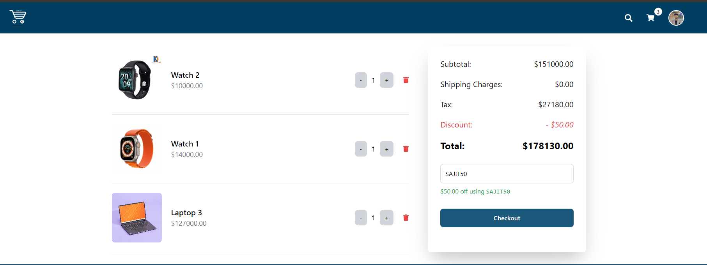

# Swift Cart

Welcome to **Swift Cart**—an e-commerce platform focused on electronic gadgets. Designed to provide a seamless and intuitive shopping experience for users while offering a robust admin panel for efficient management.

## Features

### User Features

- **Simple Sign-In/Sign-Up:** Easy to use authentication process.
- **Product Search:** Quickly find gadgets with an intuitive search feature.
- **Checkout Option:** Smooth and secure checkout with Stripe payment integration.

### Admin Features

- **Dashboard:** Comprehensive dashboard for quick insights.
- **Product Management:** Create, Read, Update, and Delete (CRUD) products effortlessly.
- **User & Order Tracking:** Monitor user activity and manage orders.
- **Inventory Management:** Keep track of stock levels.
- **Coupon Management:** Create and manage promotional coupons.
- **Statistics Visualization:** Line, bar, and pie charts for various statistics.

## Tech Stack

### Frontend

- **React:** A JavaScript library for building user interfaces.
- **Redux:** State management for React applications.
- **RTK Query:** Data fetching and caching.
- **Tailwind CSS:** Utility-first CSS framework.
- **SCSS:** Sassy CSS for modular and maintainable styles.
- **TypeScript:** Typed JavaScript for improved code quality and maintainability.

### Backend

- **Node.js:** JavaScript runtime for server-side logic.
- **Express:** Web framework for Node.js.
- **MongoDB:** NoSQL database for flexible data storage.
- **NodeCache:** In-memory caching to enhance performance.

## Project Structure

```

/swift-cart-backend
/swift-cart-frontend
/overview
README.md

```

- **`swift-cart-backend`**: Contains the backend implementation.
- **`swift-cart-frontend`**: Contains the frontend implementation.
- **`overview`**: Contains images of different pages.
- **`README.md`**: This documentation file.

## Images

Here are some screenshots of the Swift Cart application:

- **Home Page**
  

- **Dashboard Page**
  

- **Statistics Page**
  

- **Cart Page**
  
- **Auth Page**
  
